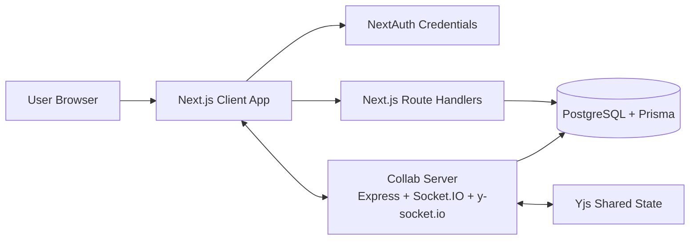
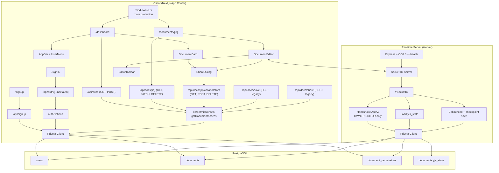
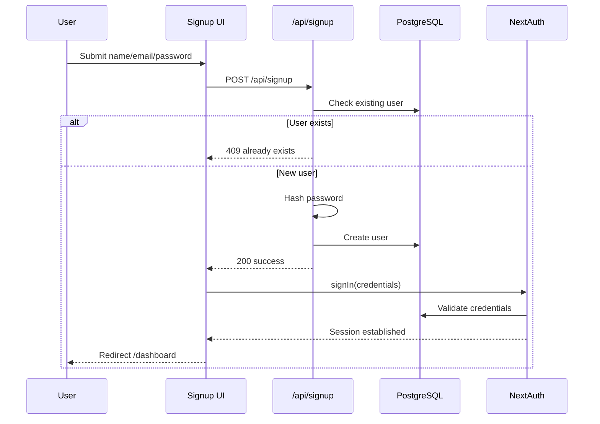
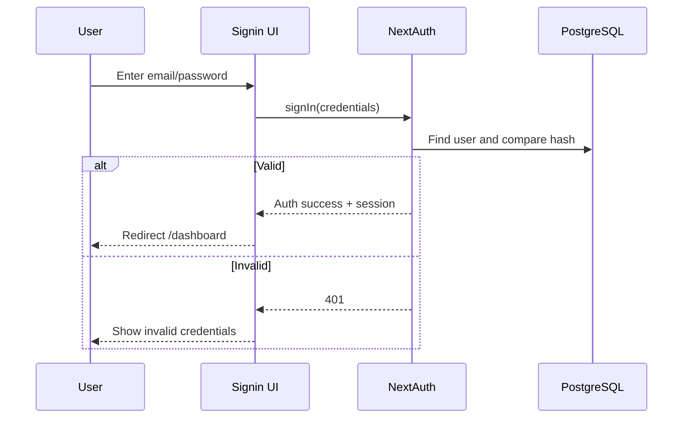
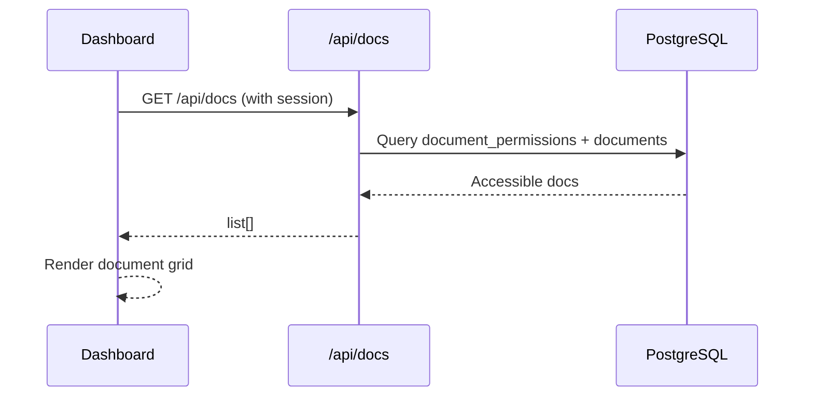
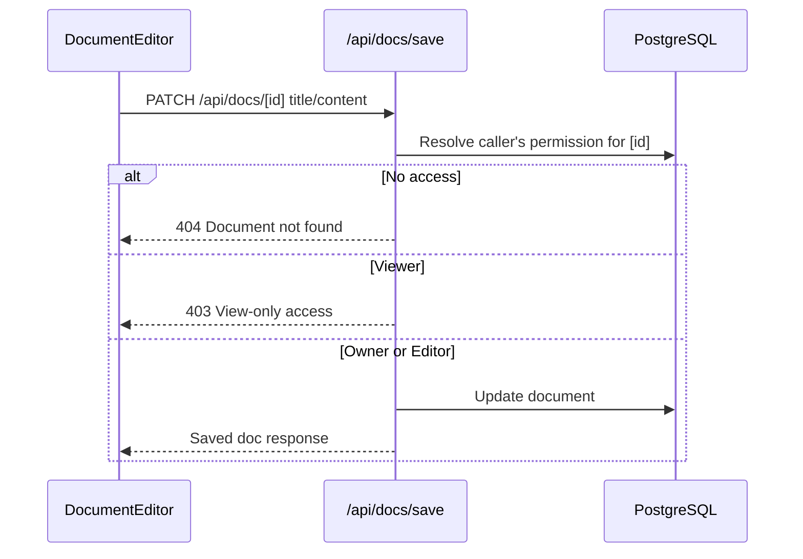
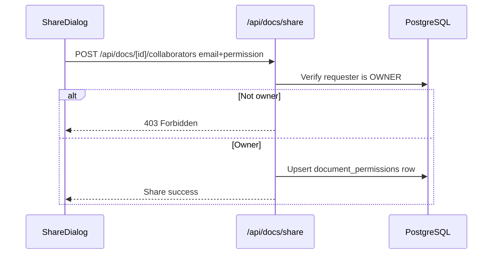
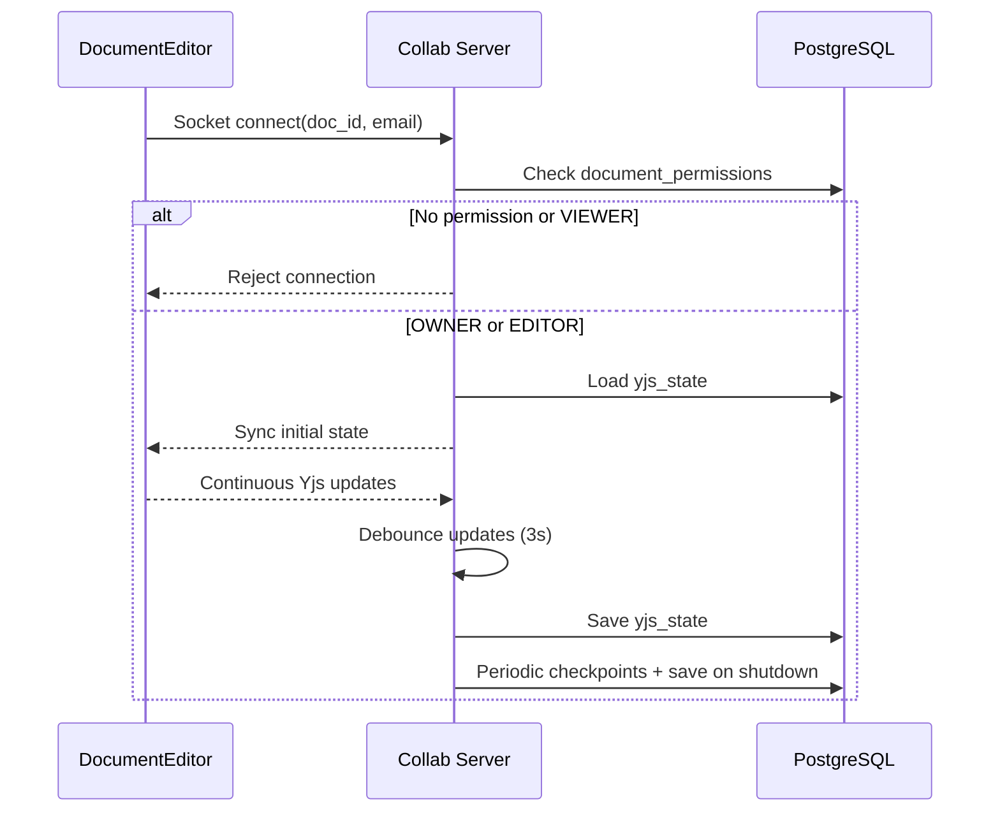
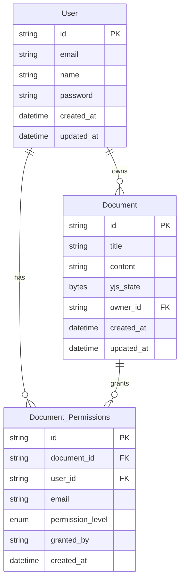

# Realtime Collaborative Docs Platform

A full-stack collaborative document editor with authentication, role-based sharing, rich text editing, and realtime multi-user collaboration.

---

## 1) Project Summary

This project is composed of:

- **Client (`/client`)**: Next.js App Router application
  - Sign up / sign in
  - Document dashboard (`/dashboard`) — search, filter, create, share, delete
  - Document editor (`/documents/[id]`) built on Tiptap, with autosave
  - Permission-scoped document APIs
  - Session management using NextAuth credentials provider
  - Route protection via `middleware.ts`
- **Collaboration Server (`/server`)**: Express + Socket.IO + Yjs sync server
  - Realtime collaboration over websocket
  - Permission check on document join
  - Debounced + periodic persistence of Yjs state
- **Database**: PostgreSQL accessed through Prisma ORM

---

## 2) High Level Design (HLD)



### HLD Notes

- Authentication is handled in the Next.js layer.
- Core document metadata/content is persisted through Next.js APIs to PostgreSQL.
- Realtime editor sync is handled by Yjs + Socket.IO server.
- Collaboration server persists binary Yjs state (`yjs_state`) back to DB for durability.

---

## 3) Low Level Design (LLD)



---

## 4) Functional Requirements

### Authentication and User Management

- User can sign up with `name`, `email`, `password`.
- Password must be hashed before DB storage.
- User can sign in using credentials provider (NextAuth).
- Session contains user identity used by protected APIs.

### Document Management

- User can create and save a document.
- User can update an existing document.
- User can fetch document list available by direct email or linked user permission.
- Owner can share document with another email and assign permission.

### Permission Model

- Permission levels: `OWNER`, `EDITOR`, `VIEWER`.
- Only authorized users can access document data.
- Collaboration join is allowed only for `OWNER` and `EDITOR`; viewers read the
  persisted document instead of joining the live session.

### Realtime Collaboration

- Multiple users can edit the same document concurrently.
- Client joins realtime room using `doc_id` and user email.
- Collaboration server authenticates join request using DB permission lookup.
- Yjs updates are synchronized to connected participants.

### Persistence

- Standard content persisted through `/api/docs/save`.
- Yjs binary state persisted from collaboration server:
  - debounced on updates
  - periodic background checkpoints

---

## 5) Non-Functional Requirements

- **Security**
  - Credential authentication with hashed passwords (`bcrypt`).
  - Server-side permission validation before data access.
  - CORS restricted to configured frontend origin(s).
  - Authenticated routes guarded at the edge by `middleware.ts`.
- **Performance**
  - Debounced autosave in the editor and on the collaboration server.
  - Periodic save as backup durability strategy.
- **Reliability**
  - Collaboration state recovered from persisted `yjs_state`.
  - Unauthorized room join attempts are rejected.
- **Accessibility**
  - Dialog/Sheet components should include titles for screen reader support.
- **Scalability (current baseline)**
  - Single collaboration server instance.
  - DB-backed shared state enables restart recovery.

---

## 6) End-to-End Workflows

### 6.1 Signup and Auto-login



### 6.2 Signin



### 6.3 Load Documents



### 6.4 Save Document (autosave)



### 6.5 Share Document



### 6.6 Realtime Collaboration



---

## 7) Data Model



---

## 8) APIs

All document routes resolve the caller's access level through
`lib/permissions.ts` before doing any work, and answer with conventional status
codes (`400` validation, `401` unauthenticated, `403` forbidden, `404` unknown
or inaccessible, `409` conflict).

### Auth

- `GET/POST /api/auth/[...nextauth]` — NextAuth credential handler.

### User

- `POST /api/signup` — creates a user after validation and password hashing.

### Documents

- `GET /api/docs` — documents the caller owns or has been given access to.
- `POST /api/docs` — creates a document owned by the caller.
- `GET /api/docs/[id]` — a single document plus the caller's access level.
- `PATCH /api/docs/[id]` — updates title and/or content. Requires `OWNER` or `EDITOR`.
- `DELETE /api/docs/[id]` — deletes the document. Requires `OWNER`.

### Sharing

- `GET /api/docs/[id]/collaborators` — lists collaborators. Requires `OWNER`.
- `POST /api/docs/[id]/collaborators` — grants or updates access for an email.
  Requires `OWNER`; only `EDITOR` and `VIEWER` may be granted.
- `DELETE /api/docs/[id]/collaborators?permissionId=…` — revokes access. Requires `OWNER`.

### Compatibility

- `POST /api/docs/save` — original save endpoint, retained and permission-scoped.
- `POST /api/docs/share` — original share endpoint, retained and permission-scoped.


## 9) Tech Stack

- **Frontend**: Next.js 15, React 19, TypeScript, TailwindCSS, Radix UI
- **Editor**: Tiptap + Yjs
- **Auth**: NextAuth (Credentials)
- **Realtime**: Socket.IO + y-socket.io
- **Validation**: Zod
- **Backend/ORM**: Node.js, Express, Prisma
- **Database**: PostgreSQL

---

## 10) Setup Requirements

### Prerequisites

- Node.js 18+ (20 LTS recommended)
- npm
- PostgreSQL database (local, or managed such as Neon / Supabase / RDS)

### Environment Variables

Templates are committed as `client/.env.example` and `server/.env.example`.
Copy them and fill in real values:

```bash
cp client/.env.example client/.env
cp server/.env.example server/.env
```

**`client/.env`**

| Variable | Required | Description |
| --- | --- | --- |
| `DATABASE_URL` | yes | PostgreSQL connection string. Managed providers usually need `?sslmode=require`. |
| `NEXTAUTH_SECRET` | yes | Signs session tokens. Generate with `openssl rand -base64 32`. |
| `NEXTAUTH_URL` | yes in production | The app's public origin, e.g. `https://your-app.vercel.app`. |
| `NEXT_PUBLIC_WEBSOCKET_URL` | yes | Public URL of the collaboration server. Reaches the browser, so it must be publicly resolvable in production. |

**`server/.env`**

| Variable | Required | Description |
| --- | --- | --- |
| `DATABASE_URL` | yes | The same database the client uses. |
| `CLIENT_URL` | yes | Allowed browser origin(s) for CORS and Socket.IO. Comma-separate to allow several. |
| `PORT` | no | Listen port (default `8080`). Most platforms inject this. |

---

## 11) Run Instructions

### Install

```bash
cd client && npm install
cd ../server && npm install
```

`npm install` runs `prisma generate` in both apps via `postinstall`.

### Database

Apply migrations once per environment:

```bash
cd client && npm run db:migrate
```

### Dev

```bash
# terminal 1 — web app
cd client && npm run dev

# terminal 2 — collaboration server
cd server && npm run dev
```

- Client: `http://localhost:3000`
- Collaboration server: `http://localhost:8080` (health check at `/health`)

### Production build

```bash
cd client && npm run build && npm start
cd server && npm run build && npm start
```

### Useful scripts

| Command | App | Description |
| --- | --- | --- |
| `npm run build` | both | Generates the Prisma client, then builds. |
| `npm start` | both | Runs the production build. |
| `npm run typecheck` | both | Type-checks without emitting. |
| `npm run lint` | client | ESLint. |
| `npm run db:migrate` | client | Applies pending Prisma migrations. |

---

## 12) Deployment

The two apps deploy separately and share one database.

### 12.1 Database

Provision PostgreSQL and apply migrations before the first deploy:

```bash
cd client && DATABASE_URL="<your-url>" npm run db:migrate
```

### 12.2 Web app (`/client`) — e.g. Vercel

- **Root directory:** `client`
- **Build command:** `npm run build` (default; runs `prisma generate` first)
- **Environment variables:** `DATABASE_URL`, `NEXTAUTH_SECRET`, `NEXTAUTH_URL`,
  `NEXT_PUBLIC_WEBSOCKET_URL`

`NEXT_PUBLIC_WEBSOCKET_URL` is inlined into the browser bundle at build time —
changing it requires a rebuild, not just a restart.

### 12.3 Collaboration server (`/server`) — e.g. Render / Railway / Fly

The collaboration server holds long-lived WebSocket connections, so it needs a
persistent Node process. It cannot run on a serverless platform.

- **Root directory:** `server`
- **Build command:** `npm run build`
- **Start command:** `npm start`
- **Health check path:** `/health`
- **Environment variables:** `DATABASE_URL`, `CLIENT_URL`, `PORT`

### 12.4 Deployment checklist

1. Migrations applied to the production database.
2. `NEXTAUTH_SECRET` set to a strong random value (not the example one).
3. `NEXTAUTH_URL` exactly matches the deployed origin, including scheme.
4. `CLIENT_URL` on the server includes the deployed web-app origin.
5. `NEXT_PUBLIC_WEBSOCKET_URL` points at the deployed collaboration server over
   HTTPS, and the platform allows WebSocket upgrades.
6. If the web app is served over HTTPS, the collaboration server must be too —
   browsers block insecure WebSocket connections from a secure page.

---

## 13) Operational Notes

- Both apps read their own `.env`; restart a process after changing one.
- `documents.yjs_state` holds the binary Yjs document. It is loaded when a
  collaboration room opens and written back on a debounce, on a periodic
  checkpoint, and on shutdown.
- The collaboration server rejects `VIEWER` handshakes: `y-socket.io` rooms have
  no read-only mode, so viewers read the persisted document through the web app
  instead of joining the live session.
- A document shared with an address that has no account yet is stored by email;
  the permission row is linked to the user id on their first sign-in.
- Keep the Prisma versions in `client` and `server` aligned.

---

## 14) Future Improvements

- Presence list showing every active collaborator in the document header.
- Document version history and restore.
- Email notifications when a document is shared.
- Integration and e2e tests for auth, permissions and collaboration.
- Horizontal scaling for the collaboration server (Socket.IO Redis adapter).
